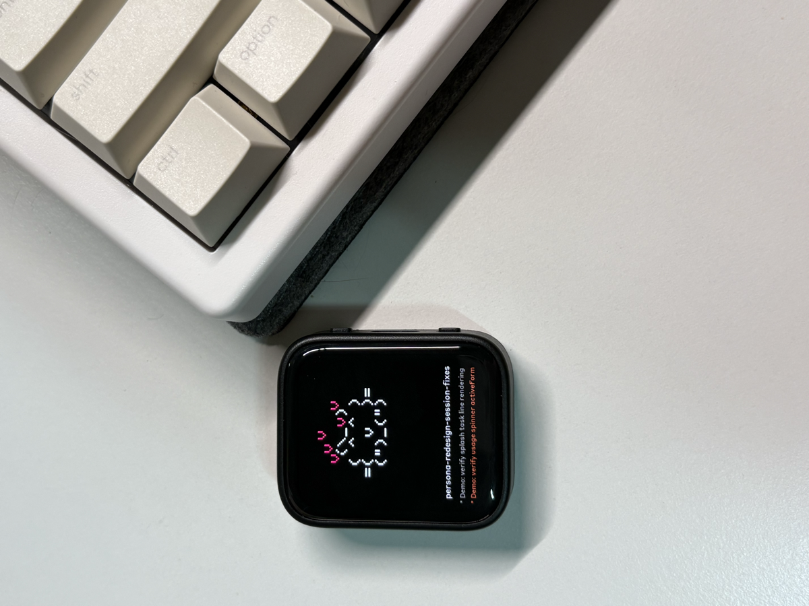
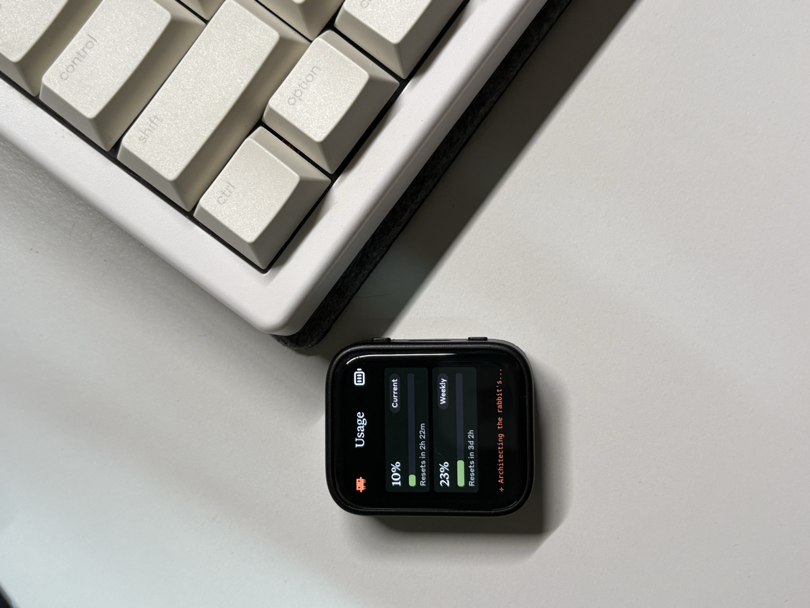

# Clawdmeter — 1.8" macOS fork

> **macOS only.** The host daemon reads the Claude Code OAuth token from the macOS Keychain via `security find-generic-password`. A Linux/Windows host would need a different token source — porting it is out of scope for this fork.

A small ESP32 desk dashboard that watches your Claude Code usage. Fork of [Clawdmeter](https://github.com/hermannbjorgvin/Clawdmeter) (2.16" panel, Linux) retargeted to the **[Waveshare ESP32-S3-Touch-AMOLED-1.8](https://docs.waveshare.com/ESP32-S3-Touch-AMOLED-1.8)** (368×448). The splash is a Tamagotchi-style ASCII rabbit ported from [claude-desktop-buddy](https://github.com/hermannbjorgvin/claude-desktop-buddy-esp32-s3-touch-amoled-1.8); the single side button sends Space over BLE HID for use as a system-wide keyboard shortcut.

## What you see

<table>
<tr>
<td width="50%" align="center"><b>Splash</b></td>
<td width="50%" align="center"><b>Usage</b></td>
</tr>
<tr>
<td></td>
<td></td>
</tr>
<tr>
<td>

- ASCII rabbit whose pose reflects current usage band (sleep / idle / busy / heart / celebrate / dizzy).
- **Session name** of the busy Claude Code session.
- **Two task lines** — `*` for in-progress, `v` for completed (subjects of the latest tracked tasks).

</td>
<td>

- **Current** — 5-hour utilization % + reset countdown.
- **Weekly** — 7-day utilization % + reset countdown.
- **Bottom spinner** — `activeForm` of the latest in-progress task while CC is busy. Falls back to `Working` if CC is busy without tracked tasks. Blank when idle.

</td>
</tr>
</table>

## Hardware

[Waveshare ESP32-S3-Touch-AMOLED-1.8](https://docs.waveshare.com/ESP32-S3-Touch-AMOLED-1.8) — ESP32-S3R8 (8 MB OPI PSRAM), 1.8" 368×448 AMOLED (SH8601 QSPI), FT3168 cap touch, AXP2101 PMU + Li-Po, QMI8658 IMU, TCA9554 I/O expander, single KEY1 button. USB-C for flashing.

The firmware uses Arduino framework 3.x via the [pioarduino](https://github.com/pioarduino/platform-espressif32) platform, LVGL 9 for the Usage/Bluetooth screens, and a raw `Arduino_Canvas` for the rabbit (LVGL displays the same 184×224 buffer 2× upscaled). Native MADCTL rotation, no CPU pixel remap.

## Build & flash

Plug the board in over USB-C, then find which `/dev/tty.usbmodem*` macOS assigned to it:

```bash
ls /dev/tty.usbmodem*
# /dev/tty.usbmodem1101   ← copy this whole path
```

Then build and upload (replace the path with what you saw above):

```bash
pio run -d firmware -t upload --upload-port /dev/tty.usbmodem1101
```

USB JTAG — no boot-mode switch needed.

Screenshot the live framebuffer (same port):

```bash
./screenshot.sh out.png /dev/tty.usbmodem1101
```

## Controls

The 1.8" board has one user button (**KEY1**, GPIO 0) plus the touchscreen.

| Action | Result |
|---|---|
| Short tap KEY1 (<700 ms) | Send a single HID Space keypress to the paired host |
| Long press KEY1 (≥700 ms) | Cycle screens: Splash → Usage → Bluetooth → Splash |
| Tap the splash | Flip to last non-splash screen (tap again to dismiss) |

The board pairs as a generic BLE keyboard, so the Space key goes wherever your cursor has focus. You can bind it inside whichever app you want as a shortcut.

## Rabbit persona

The rabbit's mood follows your Claude Code session %:

| Condition | State |
|---|---|
| BLE disconnected, or daemon reports `idle:true` (Claude Code closed / no busy session) | `sleep` |
| `status: limited`, or 5h pct > 90% | `dizzy` |
| 5% < 5h pct ≤ 90% | random pick from `busy` / `heart` / `celebrate`, re-rolled on each splash entry |
| 2% ≤ 5h pct ≤ 5% | `busy` |
| 0% < 5h pct < 2% | `idle` |
| 5h/7d window reset (Δpct ≥ 50) | `celebrate` (5 s one-shot) |
| Idle, every 25–30 min | `celebrate` (5 s random delight) |

## Daemon — macOS setup

The daemon reads your Claude Code OAuth token from the macOS Keychain entry that `claude /login` creates, polls Anthropic for rate-limit headers, and writes a compact JSON payload over BLE GATT. It's lazy: API polling only runs while a Claude Code session is `busy`, so leaving it running on a quiet machine costs nothing in tokens.

Prereqs: Python 3.9+, `claude /login` once, `pip3 install bleak`.

Pair the device first — long-press KEY1 until the Bluetooth screen appears, then **System Settings → Bluetooth → Claude Controller → Connect**. The firmware advertises with 3 BLE slots so macOS can hold the HID slot while the daemon takes a separate data slot.

Run:

```bash
python3 daemon/claude_usage_daemon.py
```

First run pops a macOS Keychain prompt — click **Always Allow**. The cached BLE address lives at `~/Library/Application Support/claude-usage-monitor/ble-address`.

### Run at login (launchd)

```bash
cp daemon/com.user.claude-usage-daemon.plist.example \
   ~/Library/LaunchAgents/com.user.claude-usage-daemon.plist
# Edit the two ProgramArguments paths inside that plist (replace
# YOUR_USERNAME and the repo path; `which python3` finds the interpreter).
launchctl bootstrap gui/$(id -u) ~/Library/LaunchAgents/com.user.claude-usage-daemon.plist
tail -f /tmp/claude-usage-daemon.log
```

Unload: `launchctl bootout gui/$(id -u) ~/Library/LaunchAgents/com.user.claude-usage-daemon.plist`.

### Troubleshooting

| Symptom | Fix |
|---|---|
| `Device not found, retry in …` | `rm ~/Library/Application\ Support/claude-usage-monitor/ble-address` to force a rescan. |
| `Claude Code OAuth token not found` | Run `claude /login`. If you previously clicked Deny on the Keychain prompt, open Keychain Access, find `Claude Code-credentials`, **Access Control** tab, add `/usr/bin/python3`. |
| Rabbit stuck on `sleep` while coding | Daemon sees no `status:busy` session. CC marks a session busy only while a turn is in flight. |
| `JSON parse error` after `git pull` | Daemon and firmware payload format diverged — rebuild and reflash. |

## Recompiling fonts

```bash
npm install -g lv_font_conv

# Styrene B (ASCII brand font, sizes the UI actually uses)
for size in 14 16 20 24 28; do
  lv_font_conv --font assets/StyreneB-Regular.otf -r 0x20-0x7E \
    --size $size --format lvgl --bpp 4 --no-compress \
    -o firmware/src/font_styrene_${size}.c --lv-include "lvgl.h"
done
```

`lv_font_conv` v1.5.3 emits LVGL 8 format. Patch each generated `.c`:

1. Remove `#if LVGL_VERSION_MAJOR >= 8` guards around `font_dsc` and the font struct.
2. Drop `.cache` from `font_dsc`.
3. Add `.release_glyph = NULL`, `.kerning = 0`, `.static_bitmap = 0` to the font struct.
4. Add `.fallback = NULL`, `.user_data = NULL` to the font struct.

Without these patches fonts compile but render invisible.

## Converting Lucide icons

```bash
node tools/png_to_lvgl.js assets/icon_bluetooth_48.png icon_bluetooth_data \
     ICON_BLUETOOTH_WIDTH ICON_BLUETOOTH_HEIGHT
```

Default tint is white; pass `--no-tint` for pre-coloured artwork. Battery icons use RGB565A8 (alpha plane) so they composite cleanly over the splash; the rest are raw RGB565. Paste output into `firmware/src/icons.h`.

## Credits

- Upstream Clawdmeter and rabbit buddy by [@hermannbjorgvin](https://github.com/hermannbjorgvin).
- Lucide icons ([lucide.dev](https://lucide.dev), MIT).
- Anthropic brand fonts (Tiempos Text, Styrene B) — see warning below.

## Licensing gray area warning

This repo bundles Anthropic brand assets (fonts, Clawd-themed naming) without permission. The code is non-proprietary but the bundled fonts and brand references aren't, so this fork isn't released under a copyleft license. Be aware if you fork or copy.
